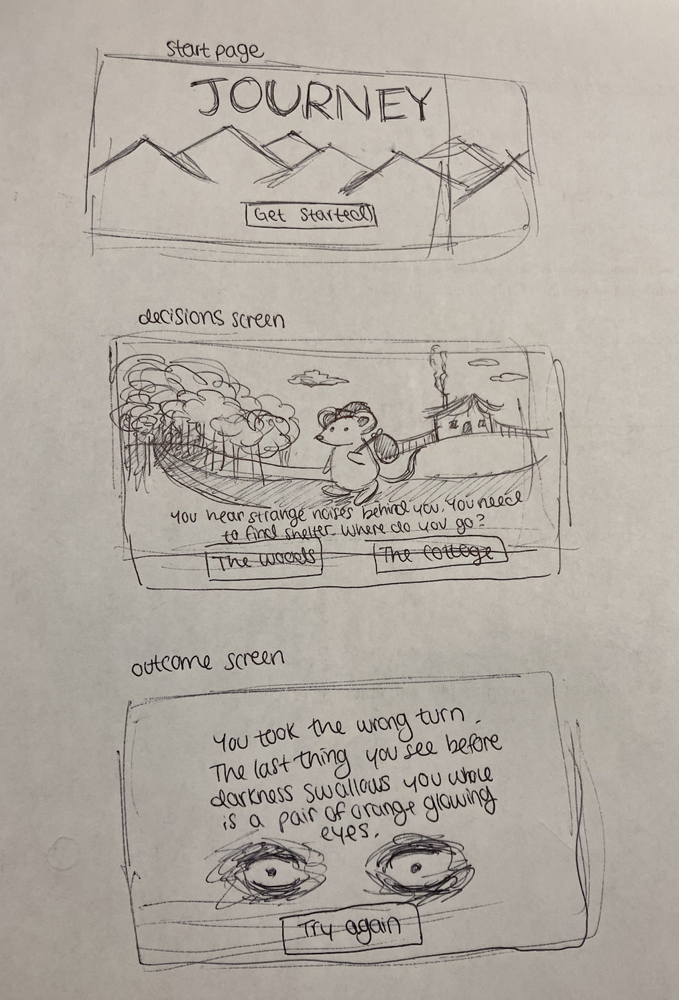
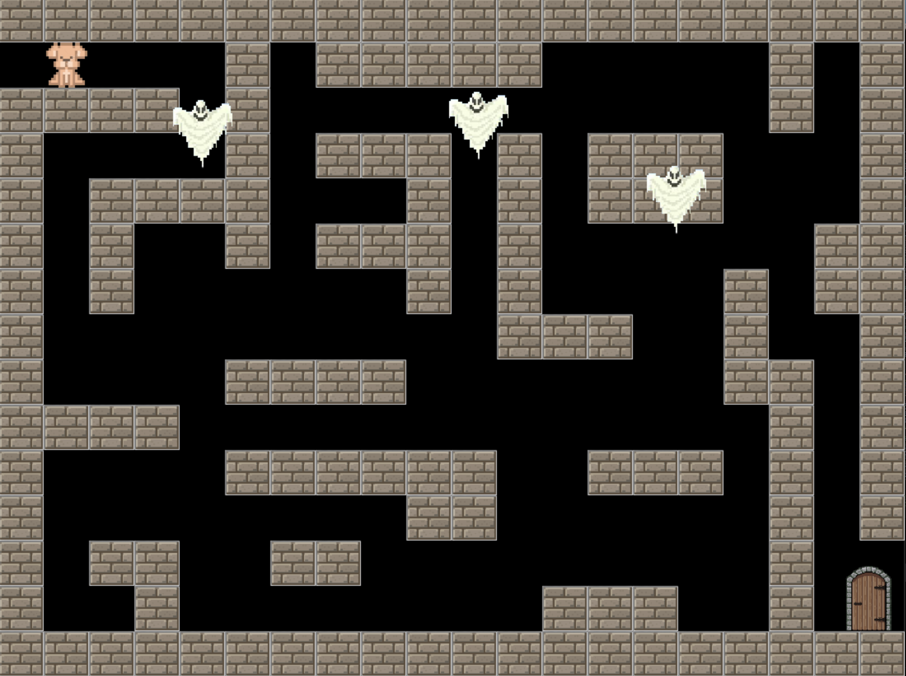

:warning: Everything between << >> needs to be replaced (remove << >> after replacing)

Mini Journey
## CS110 Final Project  Spring 2024 

## Team Members

Emily Goldstein

***

## Project Description

My project will be a "Choose Your Own Adventure" type game. I want to create a mini journey for a little character, maybe a cute mouse or gnome, and the user's decisions will influence the journey. 

***    

## GUI Design

### Initial Design

### Final Design

## Program Design

### Features

1. start menu
2. moveable character
3. clickable options
4. different routes
5. final outcome screen 

### Classes

- << You should have a list of each of your classes with a description >>

## ATP
Test Case 1: Menu Screen Functionality 
-Test Description: Verify that the main menu buttons work.
-Test Steps:
    1. Start the game. 
    2. Press the "Start" button.
    3. Verify the game starts when the button is pressed.
    4. Press the "x" button.
    5. Verify the game exits when the button is pressed.
-Expected Outcome: The menu displays all necessary buttons, and the necessary buttons work as intended.

Test Case 2: Mouse Movement 
-Test Description: Verify that the mouse moves left, right, up, and down with appropriate arrow keys.
-Test Steps:
    1. Start the game. 
    2. Press the left arrow key. 
    3. Verify the mouse moves left. 
    4. Press the right arrow key. 
    5. Verify the mouse moves right. 
    6. Press the up arrow key. 
    7. Verify the mouse moves up. 
    8. Press the down arrow key. 
    9. Verify the mouse moves down. 
-Expected Outcome: The mouse moves the appropriate direction that corresponds with the arrow keys. 

Test Case 3: Wall Collision
-Test Description: Verify that the mouse cannot cross over the wall barriers.
-Test Steps:
    1. Start the game.
    2. Run the mouse into the walls. 
    3. Verify that the walls act as a barrier. 
-Expected Outcome: The mouse cannot cross over the walls. 

Test Case 4: Item pickup
-Test Description: Verify that items can be picked up when ran into.
-Test Steps:
    1. Start the game.
    2. Run the mouse into items. 
    3. Verify that the item disappears.
-Expected outcome: The item disappears when the mouse collides with it. 

Test Case 5: Key Functionality
-Test Description: Verify the key works when picked up. 
-Test Steps:
    1. Start the game.
    2. Pick up the key. 
    3. Walk to the exit with the key. 
    4. Verify that the end screen is displayed.
-Expected outcome: The end screen is displayed when the mouse goes through the exit with the key. 